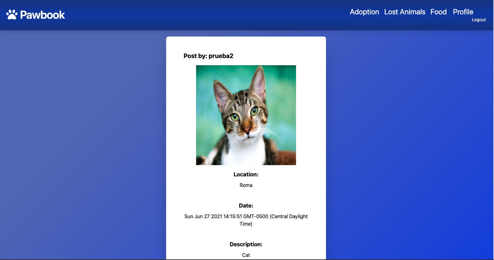
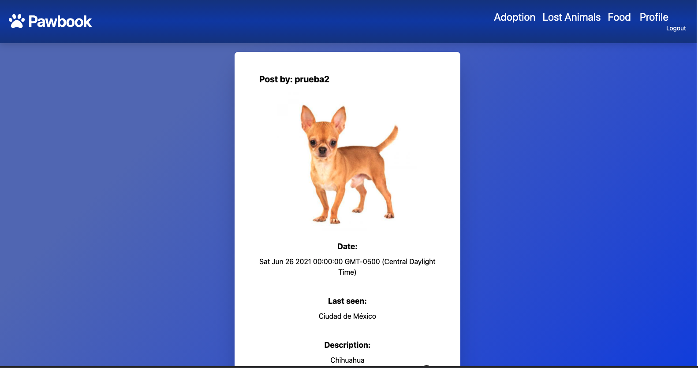
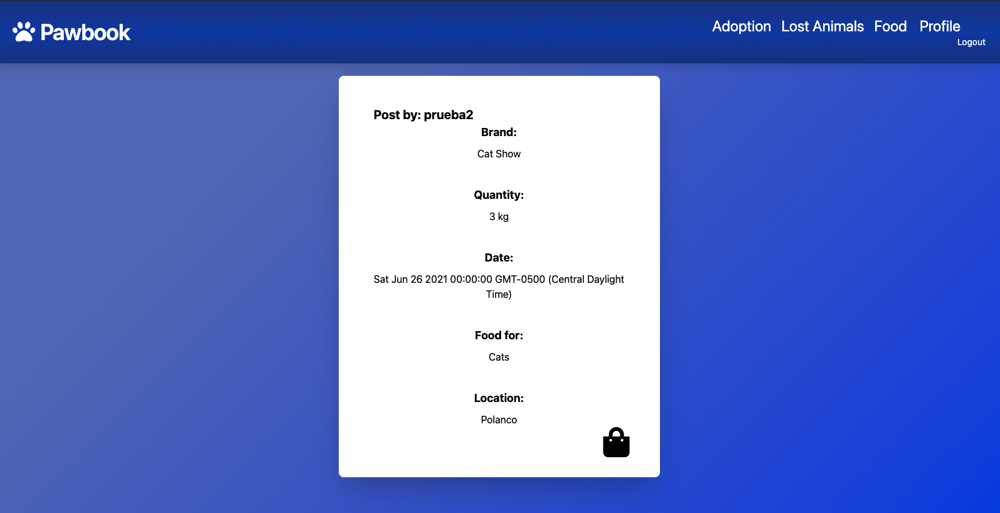
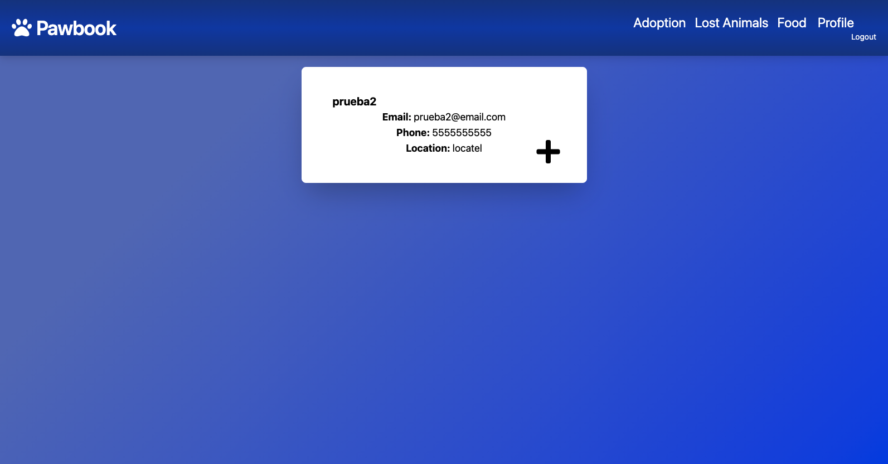

# Pawbook

## Description

Regardless of laws against animal abuse in México, Mexico ranks first in animals that have been abandoned to live in the streets, condemned to despair, suffering and hunger. Most of these animals came to the streets due to carelessness and negligence. Many unsterilized pups are abandoned. If they survive, in many cases they reproduce, giving birth to another generation of puppies relegated to living abroad. With this in mind, we decided to create Pawbook, to help this animals find a home.

## Table of Contents
- [Installation](#installation)
- [Usage](#usage)
- [Credits](#credits)
- [License](#license)
- [Features](#features)

## Installation

This project has been deployed to GitHub.
https://github.com/stamm2911/Project_2

 To get this project up and running, you can follow the deployment link.
https://stormy-savannah-69028.herokuapp.com/login

 
## Usage

- Create your new Pawbook account or Log in if you already have one

- The adoption page will be the first one to be prompt 

- Thenthe navbar you can choose if you want to see the post of Lost Animals and Food

- The last option in the nav bar will send you to your profile where you can make a new post

- Video usage:

## Credits
- Eduardo Stamm
- Alejandro de la Lama
- Eduardo Martínez
- Regina Soto
## License

Pawbook

## Features
- HTML
- CSS
- JS
- NODEJS
- EXPRESS
- MYSQL
- ORM 
- MVC
- Tailwind
